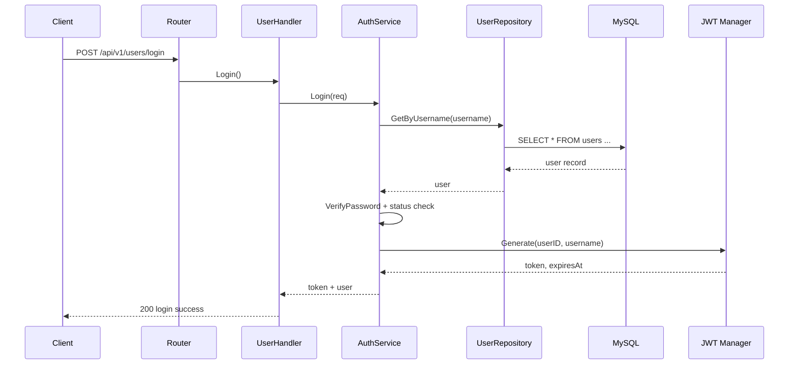

# User Service 全流程与架构说明

## 1. 服务定位
`user-service` 是一个基于 Gin + GORM 的用户认证与资料服务，当前提供 4 个核心能力：

- 用户注册：`POST /api/v1/users/register`
- 用户登录：`POST /api/v1/users/login`
- 查询个人资料：`GET /api/v1/users/profile`（需 JWT）
- 更新个人资料：`PUT /api/v1/users/profile`（需 JWT）

它在项目中的职责边界比较清晰：负责用户身份相关逻辑（账号、密码、令牌、基本资料），不负责商品、库存、订单等领域。

## 2. 分层架构
代码采用典型的分层结构：

- `cmd/main.go`：程序入口，装配依赖并启动 HTTP 服务
- `internal/bootstrap`：基础设施初始化（配置、MySQL、Redis）
- `internal/router`：路由定义与中间件挂载
- `internal/middleware`：JWT 鉴权中间件
- `internal/handler`：HTTP 入参绑定、状态码和响应封装
- `internal/service`：业务规则（注册、登录、资料查询与更新）
- `internal/repository`：数据库访问（GORM）
- `internal/model`：数据模型与请求 DTO
- `internal/pkg/*`：通用能力（JWT、密码哈希、响应结构）

整体依赖方向是单向的：

`router -> handler -> service -> repository -> mysql`

`middleware -> jwt/pkg`

这保证了 HTTP 层和存储层解耦，便于后续替换实现（例如切换存储、增加缓存、扩展认证方式）。

## 3. 启动全流程
以下是服务从启动到可对外提供接口的完整链路。

### 3.1 入口与依赖装配
`cmd/main.go` 执行顺序：

1. 调用 `bootstrap.Initialize("./config")`
2. 使用配置创建 `jwtManager`
3. 创建 `userRepo`
4. 创建 `authService`
5. 创建 `userHandler`
6. 创建 Gin 路由 `router.New(userHandler, jwtManager)`
7. 读取 `server.port` 并 `r.Run(addr)` 启动服务

### 3.2 配置加载
`internal/config/config.go` 使用 Viper：

- 配置文件：`config/config.yaml`
- 支持环境变量覆盖，前缀：`USER_SVC`
- 例如 `USER_SVC_SERVER_PORT` 会覆盖 `server.port`

主要配置项：

- `server.port`
- `database.{host,port,user,password,dbname,charset}`
- `redis.{host,port,password,db}`
- `jwt.{secret,expire}`

### 3.3 MySQL 初始化与重试
`bootstrap.connectMySQLWithRetry` 具备容错启动能力：

- 最大重试次数：20
- 重试间隔：2 秒
- 每轮都会：
  - `gorm.Open`
  - 取底层 `sqlDB`
  - `PingContext(2s timeout)`

连接成功后执行自动迁移：

- `db.AutoMigrate(&model.User{})`

因此首次启动可自动创建/更新 `users` 表结构。

### 3.4 Redis 初始化
`Initialize` 中会创建 Redis Client 并执行 `Ping`：

- 若 ping 失败，只打印 warning，不阻断服务启动

这意味着当前版本 Redis 不是强依赖（主要是预留基础设施能力）。

## 4. 路由与接口编排
`internal/router/router.go` 路由结构：

- 公共前缀：`/api/v1`
- 用户分组：`/users`
- 公共接口：
  - `POST /register`
  - `POST /login`
- 鉴权接口（挂载 `JWTAuth`）：
  - `GET /profile`
  - `PUT /profile`

## 5. 认证与安全机制

### 5.1 密码安全
`internal/pkg/security/password.go`：

- 注册时：`bcrypt.GenerateFromPassword` 生成哈希后入库
- 登录时：`bcrypt.CompareHashAndPassword` 对比

数据库不会保存明文密码。

### 5.2 JWT 令牌
`internal/pkg/jwt/jwt.go`：

- 签名算法：HMAC（`HS256`）
- 载荷包含：`user_id`、`username`、`iat`、`exp`
- 过期时间：由配置 `jwt.expire` 决定（小时），默认兜底 24h

### 5.3 鉴权中间件
`internal/middleware/jwt_auth.go`：

1. 读取 `Authorization` Header
2. 校验格式必须是 `Bearer <token>`
3. 调用 `jwtManager.Parse` 验证签名和有效期
4. 将 `claims.UserID` 写入 Gin Context（key: `user_id`）
5. 后续 Handler 通过 `GetUserID` 取出当前用户 ID

失败时统一返回 `401`。

## 6. 四个核心接口的端到端流程

## 6.1 注册 `POST /api/v1/users/register`

1. `UserHandler.Register` 绑定 JSON 到 `RegisterRequest`
2. `AuthService.Register` 先查用户名是否存在（`GetByUsername`）
3. 若已存在，返回 `ErrUserExists`
4. 对密码做 bcrypt 哈希
5. 组装 `model.User` 并 `Create`
6. Handler 返回 `200` + 用户基础信息（不含密码）

关键规则：

- 用户名唯一
- 密码不明文存储

## 6.2 登录 `POST /api/v1/users/login`

1. `UserHandler.Login` 绑定 `LoginRequest`
2. `AuthService.Login` 根据用户名查询用户
3. 校验密码
4. 校验账号状态（`status == 0` 视为不可登录）
5. `jwtManager.Generate` 生成 token 和过期时间
6. Handler 返回 `200` + `token` + `expires_at` + 简要用户信息

失败（账号不存在/密码错误/状态不可用）统一映射为 `401`。

## 6.3 查询资料 `GET /api/v1/users/profile`

1. 请求先经过 `JWTAuth`
2. Handler 从 Context 取 `user_id`
3. `AuthService.GetProfile` 查询用户
4. 若不存在返回 `404`
5. 存在则返回用户资料

## 6.4 更新资料 `PUT /api/v1/users/profile`

1. 请求先经过 `JWTAuth`
2. Handler 取 `user_id` 并绑定 `UpdateProfileRequest`
3. `AuthService.UpdateProfile` 校验至少有一个字段要更新（email/phone）
4. 查询用户是否存在
5. 将空字段保留为旧值，非空字段应用新值
6. Repository 执行 `Updates`
7. Handler 返回 `200`（data 为空）

关键规则：

- 空请求会返回 `ErrNothingToUpdate`（400）
- 只允许更新邮箱和手机号

## 7. 数据模型
`internal/model/user.go` 的 `users` 表对应字段：

- `id`：主键，自增
- `username`：唯一索引，非空
- `password`：哈希值，非空
- `email`：可空
- `phone`：普通索引
- `status`：默认 `1`
- `created_at`、`updated_at`

时间字段由 GORM 自动维护。

## 8. 统一响应规范
`internal/pkg/response/response.go` 定义统一响应体：

```json
{
  "code": 200,
  "message": "login success",
  "data": {}
}
```

说明：

- `code` 与 HTTP 状态码一致
- `message` 为可读信息
- `data` 根据接口返回对象或 `null`

## 9. 错误映射策略
当前错误处理遵循“业务错误显式映射，系统错误统一 500”：

- `ErrUserExists` -> `400`
- `ErrInvalidCredentials` -> `401`
- `ErrUserNotFound` -> `404`
- `ErrNothingToUpdate` -> `400`
- 其他未识别错误 -> `500`

这让客户端可以稳定地区分可预期业务失败与服务异常。

## 10. 时序图（登录链路）


## 11. 当前实现边界与可演进点

- Redis 当前仅做连通性探活，尚未用于会话、黑名单、验证码、限流
- JWT 仅包含基础身份字段，未引入 token 版本号或撤销机制
- 资料更新未做邮箱/手机号唯一性约束（按业务需要可补）
- 缺少更细粒度审计日志与指标埋点

可优先考虑的增强方向：

1. 引入刷新令牌（Refresh Token）与登出失效机制
2. 使用 Redis 维护 JWT 黑名单或 token 版本
3. 增加注册/登录频率限制与风控策略
4. 增加单元测试和集成测试覆盖（尤其是错误分支）
